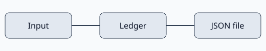

# Parcel Ledger 架构方案

## 使用场景

LEGACY-ARCH-001：仓库管理员在单台电脑上登记包裹编号、货架位置与领取时间。此文档描述历史设计方案，样本尚无实现代码。

## 模块边界

录入界面负责字段输入与提示；登记模块负责包裹编号唯一性；文件存储模块负责加载和保存 JSON。登记模块不直接访问文件系统。

## 数据流

用户提交包裹编号后，登记模块先检查重复编号，再通过存储接口写入本地文件。读取失败时保留原文件并显示错误，不以空数据覆盖历史记录。

## 存储约束

LEGACY-ARCH-002：当前纸面方案没有账号系统、网络同步或多机并发能力。相关选择见[本地存储提案](storage-decision.md#决策与理由)。

